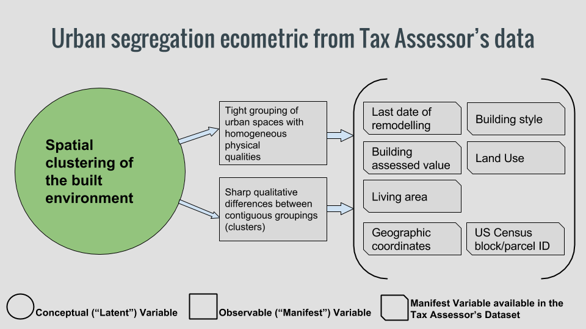

Administrative datasets are good sources for the measurement of neighborhood economic, environmental, and societal characteristics - what we call neighborhood ecometrics. As administrative datasets record transactions concerning city life, marked with date and location information, we can group observations related to specific moments or specific urban areas, and investigate how different places and periods compare to each other. 

The kind of ecometrics we are interested in (like "livability", economic development, socio-cultural cohesion, etc) are not usually registered as such in databases. They are intrinsic, and not directly measurable: these are latent characteristics. We can't directly measure them, but we can infer their presence (or lack thereof) by detecting related characteristics that we can indeed observe. If we analyze an administrative dataset, we can say that what the non-directly observable phenomena we want to know about is a latent construct, and what we can actually measure are related manifest variables.

I'll provide a specific example. I'm interested in the level of urban segregation of different areas in Boston. "Segregation" is a word that has been used to describe a variety of complex urban issues, usually related to inequality: as such, different authors speak of spatial, social, economic, cultural, or political segregation.

I'll consider urban segregation as a social divide that manifests itself in the unequal and highly differentiated use of urban space. It can be illustrated with this picture of an extreme case in Mexico:

This issue is rampant in many cities in the Global South, where gated communities sometimes coexist with informal settlements separated only by a wall. While surely not as acute, how prevalent is urban segregation in Boston?

To answer that question we need to develop a model that will allow us to measure this latent construct -a social divide- by comparing its manifest variables.

Since we are using the Tax Assessor's Dataset, which describes the value, location, ownership and physical characteristics of city parcels, we'll focus on those manifest variables that we have access to:

We'll make use of of geo-referentiation attributes of different granularities (like neighborhodd, census tracts and block level) to find out if areas that seem to be mixed, at least in aggregate, but are in fact segregated once you inspect their internal constitution -like "false mixed neighborhoods" which include inhabitants with diverse racial or socio-economic backgrounds, that in fact live in separated internal areas.

Having explained what we are looking for, our next objective will be the development of a methodology, which will include as tasks:

* Define attributes to analyze for segregation: values, land use, etc.

* Establish an arithmetic definition of heterogeneity.

* Establish a way to compare heterogeneity at one level to the heterogeneity at a nested level (ie entire city vs. neighborhoods; census tract vs. internal blocks).
