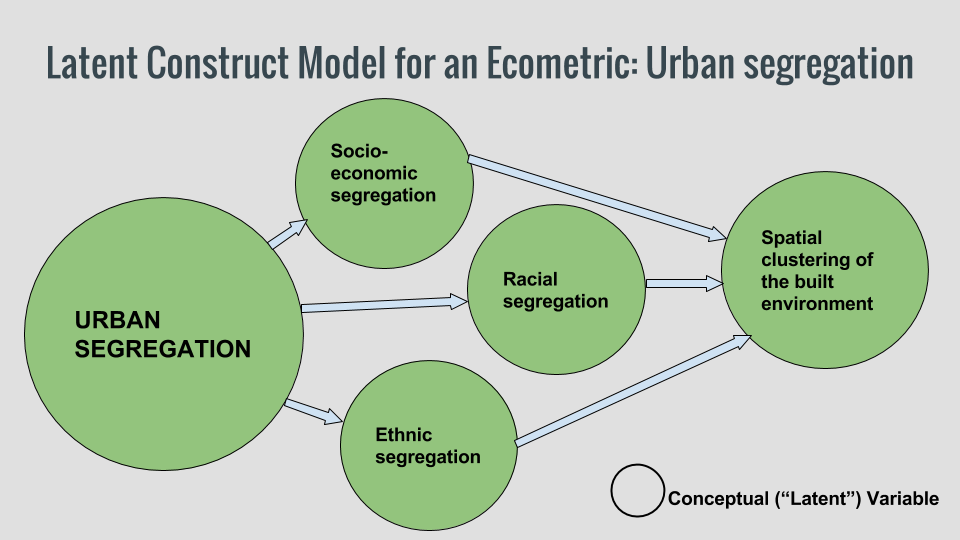
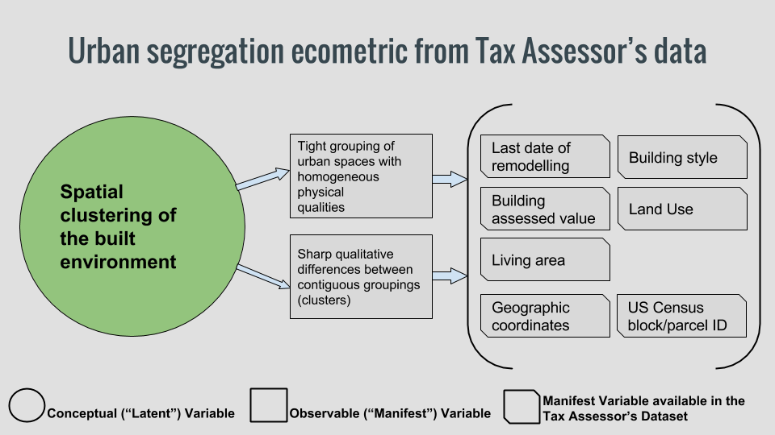

Administrative datasets are good sources for the measurement of neighborhood economic, environmental, and societal characteristics - what we call neighborhood ecometrics. As administrative datasets record transactions concerning city life, marked with date and location information, we can group observations related to specific moments or specific urban areas, and investigate how different places and periods compare to each other. 

The kind of ecometrics we are interested in (like "livability", economic development, socio-cultural cohesion, etc) are not usually registered as such in databases. They are intrinsic, and not directly measurable: these are latent characteristics. We can't directly measure them, but we can infer their presence (or lack thereof) by detecting related characteristics that we can indeed observe. If we analyze an administrative dataset, we can say that what the non-directly observable phenomena we want to know about is a latent construct, and what we can actually measure are related manifest variables.

I'll provide a specific example. I'm interested in the level of urban fragmentation of different areas in Boston. "Fragmentation" is a word that has been used to describe a variety of complex urban issues, usually related to inequality: as such, different authors speak of spatial, social, economic, cultural, or political fragmentation.[(Michelutti, E. - 2010)](http://n-aerus.net/web/sat/workshops/2010/pdf/PAPER_michelutti_e.pdf) 
I'll consider urban fragmentation as a socio-economic divide that manifests itself in the unequal and highly segregated use of urban space. It can be illustrated with this picture of an extreme case in Mexico:

This issue is rampant in many cities in the Global South, where gated communities sometimes coexist with informal settlements separated only by a wall. While surely not as acute, how prevalent is urban fragmentation in Boston?

To answer that question we need to develop a model that will allow us to measure this latent construct -a socio-economic divide- by comparing its manifest variables.

###Latent Construct Model for an Ecometric: Urban fragmentation

Since we are using the Tax Assessor's Dataset, which describes the value, location, ownership and physical characteristics of city parcels, we'll focus on those manifest variables that we have access to:

###Latent Construct Model for an Ecometric: Urban fragmentation from Tax Assesor's data

---

Note to Professor O'Brien:
This is what I would like to find out by using the TA dataset. To keep digging, I'll start using GIS libraries, as I guess that the best way to analyze this is by using  choroplet maps. But that is for later, right? As for this post, I'm not quite sure on how to close it. Maybe R code showing the actual content of the variables I propose?

