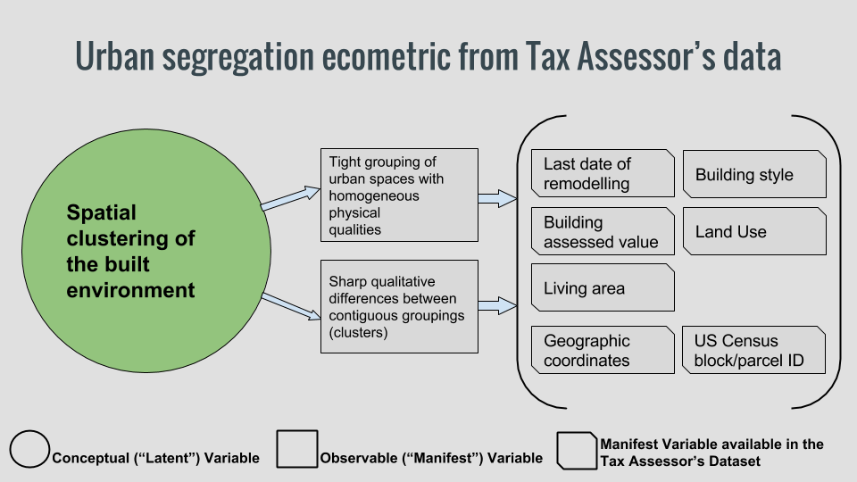

```{r, echo=FALSE}
options(scipen = 99) # this prevents R from using scientific notation to display large numbers

library(ggplot2)
TAdata <- read.csv('C:/Users/havb/Dropbox/MSUI/Big Data for Cities - PPUA 5262 - 01/R/Boston-Tax-Assesor-Dataset-2015/data/Tax Assessor 2015 - Data.csv', stringsAsFactors = FALSE) #load the Tax Assesor dataset

TAdata <- transform(TAdata, AV_LAND_PER_SF = ifelse((AV_LAND != 0 & LAND_SF != 0), AV_LAND / LAND_SF, NA))


```

##The goal

Last week, we proposed a couple of build environment ecometrics as instruments to measure the spatial clustering of Boston's build environment:



We are interestedn in specific caracteristics of the neighborhoods (ecometrics) that are not directly expressed in our dataset, but maybe observable as "latent constructs" -that is, measurable by proxy if we know what to look for. We'll start exploring how to define these latent constructs as arithmetic functions that can be coded in R.

## Choosing variables

First of all, let's examine the available variables in the Tax Assessor's dataset. Since we are looking for an index of heterogeneity of the built environment, good candidates for our purposes are:

* LU (Land Use)
* LAND_SF
* GROSS_AREA (Gross floor area for commercial properties.)
* LIVING_AREA (Total living area for residential properties)
* YR_BUILT
* R_BLDG_STYL (Residential building style)
* S_BLDG_STYL (Condo main building style)
* BRA_PD (Boston Redevelopment Authority Planning District)
* AV_LAND_PER_SF (Assessed land value per square foot)
* AV_BLDG_PER_SF (Assessed building value per square)


## Building some constructs

Let's begin with Land Use. How it differs from one neighborhood to another?

Before we start our analysis, we'll fix a single parcel in the entire dataset with LU = "XX", a land use code that is not registered in the datasat dictionary. Since the parcel is owned by a church, we'll assume it is a Tax Exempt parcel.

```{r}
TAdata[TAdata$LU == 'XX',]$LU <- "E"
```

Now, we can see that there are 17 different land uses codes in our dataset:

```{r}
unique(TAdata$LU)
length(unique(TAdata$LU))
```

So we can try counting how many land uses are present in each neighborhood:

```{r}
aggregate(LU~BRA_PD, data = TAdata, function(x) length(unique(x)))
```

That wasn't very informative; every neighborhood contains most of the land uses. (Jamaica Plain is the only neighborhood with the complete collection!).
We'll need to develop a much more nuanced way to analyze land use distribution to reach interesting conclusions.

What about land area? We can find the variance of land area as a measure of how diverse (in size) plots are in each neighborhood:

```{r}
plot.size.variance <- aggregate(LAND_SF~BRA_PD, data = TAdata, var)
plot.size.variance[with(plot.size.variance, order(-LAND_SF)),]
```

East Boston has by far the largest plot size variance, and Back Bay the lowest.

Is the average land value in a neighborhood somehow related to the plot size diversity?

We can find out if we aggregate the median land value per square foot and plot it against parcel size variance:

```{r}
land.value.median <- aggregate(AV_LAND_PER_SF~BRA_PD, data = TAdata, median)

plot.variance.land.value <- merge(plot.size.variance, land.value.median, by = 'BRA_PD')

names(plot.variance.land.value)[2:3] <- c("VARIANCE_LAND_SF","MEDIAN_AV_LAND_SF" )

library(ggplot2)

ggplot(plot.variance.land.value, aes(x = VARIANCE_LAND_SF, y = MEDIAN_AV_LAND_SF)) +
  geom_point(colour = 'red', size =3) +
  geom_smooth(method=lm, se=FALSE) +
  scale_x_log10() + scale_y_log10() + geom_text(aes(label=BRA_PD),vjust=1) +
  labs(title='Boston neighborhoods: median land value per parcel size variance',
       x='Plot size variance',y='Median land value per sqf') +
  theme(plot.title = element_text(size = 24, face="bold"),
        axis.title.x = element_text(size=18),
        axis.title.y = element_text(size=18),
        axis.text.x = element_text(size=14),
        axis.text.y = element_text(size=14))


```

The correlation is stronger than what I expected!

Let's now compare the mean age of buildings with their median assessed value.

```{r}

bldg.value.median <- aggregate(as.integer(AV_BLDG_PER_SF)~BRA_PD, data = TAdata, median)

year.mean <- aggregate(YR_BUILT~BRA_PD, data = TAdata, mean)

year.mean.bldg.value <- merge(year.mean, bldg.value.median, by = 'BRA_PD')

names(year.mean.bldg.value)[2:3] <- c("MEAN_YR_BUILT","MEDIAN_AV_BLDG_SF" )

ggplot(year.mean.bldg.value, aes(x = MEAN_YR_BUILT, y = MEDIAN_AV_BLDG_SF)) +
  geom_point(colour = 'red', size =3) + 
  geom_smooth(method=lm, se=FALSE) +
  scale_y_log10() + geom_text(aes(label=BRA_PD),vjust=1) + 
  labs(title='Boston neighborhoods: median building value per building age',
       x='Year of construction (mean)',y='Median building value per sqf') +
  theme(plot.title = element_text(size = 24, face="bold"),
        axis.title.x = element_text(size=18),
        axis.title.y = element_text(size=18),
        axis.text.x = element_text(size=14),
        axis.text.y = element_text(size=14))


```

Another interesting result: older building stocks tend to be more "valuable" that the more recent ones.

What about last year of remodeling and assessed building value?

```{r}

remodel.year.mean <- aggregate(YR_REMOD~BRA_PD, data = TAdata, mean)

remodel.year.mean.bldg.value <- merge(remodel.year.mean, bldg.value.median, by = 'BRA_PD')

names(remodel.year.mean.bldg.value)[2:3] <- c("MEAN_YR_REMODEL","MEDIAN_AV_BLDG_SF" )

ggplot(remodel.year.mean.bldg.value, aes(x = MEAN_YR_REMODEL, y = MEDIAN_AV_BLDG_SF)) +
  geom_point(colour = 'red', size =3) +
  geom_smooth(method=lm, se=FALSE) +
  scale_y_log10() + geom_text(aes(label=BRA_PD),vjust=1) + 
  labs(title='Boston neighborhoods: Median building value per recency of remodel', 
       x='Last year of remodel (mean)',y='Median building value per sqf') +
  theme(plot.title = element_text(size = 24, face="bold"),
        axis.title.x = element_text(size=18),
        axis.title.y = element_text(size=18),
        axis.text.x = element_text(size=14),
        axis.text.y = element_text(size=14))


```

This seems un-intuitive: The neighborhoods with higher building assessed values tend to be those with less recent remodels. And this correlation is stronger than that of building age and assessed value. 

Also worth mentioning, a repeating outlier in all of these plots is East Boston.

---

##Digging deeper into the "land use identity" construct

We'll turn our attention again to land use. The dataset includes 17 different types of land use, which we'll simplify into a more manageable group of nine: Residential, Commercial, Condo, Mixed Residential/Commercial, Agricultural, Industrial, Tax Exempt, and Tax Exempt by the Boston Redevelopment Authority (this last categories applies to parcels that are undergoing renovation projects)

```{r}

simplify_LU <- function(LU) {
  if (LU %in% c("R1", "R2", "R3", "R4", "RL", "A")) {
      return("RESIDENTIAL")
    } else if (LU %in% c("CM", "CP")) {
      return("CONDO")
    } else if (LU == "CD") {
      return("CONDO_UNIT")
    } else if (LU == "RC") {
      return("MIX_RC")
    } else if (LU %in% c("CC", "C", "CL")) {
      return("COMMERCIAL")
    } else if (LU == "AH") {
      return("AGRICULTURAL")
    } else if (LU == "I") {
      return("INDUSTRIAL")
    } else if (LU == "E") {
      return("TAX_EXEMPT")
    } else if (LU == "EA") {
      return("TAX_EXEMPT_BRA")
    } else {
      return(NA)
    }
}


#Create a new column by applying the simplifyLU function
TAdata <- transform(TAdata, SIMPLIFIED_LU = sapply(LU, simplify_LU))

```

With the help of our new simplified land use code, we'll create a table showing what percentage of total parcel area each land use represents by neighborhood:

```{r message = FALSE}

library(dplyr)
library(tidyr)

# Remove Condo Units as we are now interested in neighborhood total areas and CU areas should not be summed
TAdata.no.condo.units <- filter(TAdata, LU != "CD")

# Group occupied area by neighborhood and land use
NB.LAND.USE <- summarise(group_by(TAdata.no.condo.units, BRA_PD,SIMPLIFIED_LU),
                         extension = sum(as.numeric(LAND_SF), na.rm = TRUE))

# Remove parcels with no neighborhood iformation
NB.LAND.USE <- filter(NB.LAND.USE, !is.na(BRA_PD))

# "Spread" the land use variables as one long row per neighborhood
NB.LAND.USE <- spread(NB.LAND.USE, SIMPLIFIED_LU, extension)

# Replace NAs with 0s
NB.LAND.USE[is.na(NB.LAND.USE)] <- 0

# Add a total area column
NB.LAND.USE <- transform(NB.LAND.USE, TOTAL_AREA = rowSums(NB.LAND.USE[2:9]))

# Tranform the lan use coverage areas into percentages
NB.LAND.USE[2:9] <- sapply(NB.LAND.USE[2:9], function(x) { round(x / NB.LAND.USE[10] * 100, 2)})

```


```{r}

NB.LAND.USE
```

The predominance of the "Tax Exempt" land use is surprising. East Boston, already identified as a recurring outlier, has more than 99% of its parcel area under tax exemption; the location of Logan Airport surely has a lot to do with this.

It's not easy to visualize how similar -or different- 16 elements are based on 8 attributes, but we can attempt it using a star plot:

```{r}
row.names(NB.LAND.USE) <- NB.LAND.USE$BRA_PD
NB.LAND.USE <- NB.LAND.USE[2:10]
#we plot everything except column 10 (total area)
stars(NB.LAND.USE[1:8], flip.labels = FALSE, 
      key.loc = c(13, 3),  draw.segments=TRUE, 
      main = "Boston Neighborhoods: comparative predominance of land uses",
      col.segments = c("#A65628","#377EB8","#4DAF4A","#984EA3",
              "#FF7F00","#FFFF33", "#F781BF","#E41A1C"))

```

At last, we are approximating something like a land use based characterization of the city's neighborhoods. As said before, East Boston looks like an entirety of tax-exempt parcels. Back Bay and the Central district have a lot in common, because of the predominance of condo an commercial uses. Jamaica Plain is maybe the most diverse neighborhood in land uses, and the only one with agricultural parcels (the complete absence of this land use in other neighborhoods is what makes it so large for JP -this is a cross-comparison). North Dorchester takes the crown for mixed residential/commercial use -by far-, and South Rochester for residential. South Boston is where industrial parcels are most extended, followed by Allston/Brighton. Roxbury has the most amount of its surface covered by parcels under the Boston Redevelopment Authority tax exemption program, followed by the South End and Jamaica Plain. If we take out favorite outlier East Boston, Mattapan is the neighborhood with the least coverage of both commercial and condo land use, being in that sense like the inverse of Back Bay/Beacon Hill.

Having visualized the land use distribution, our future efforts will be focused towards achieving a mathematical formula to calculate an "identity" that we can use to compare the City's neighborhoods. 
