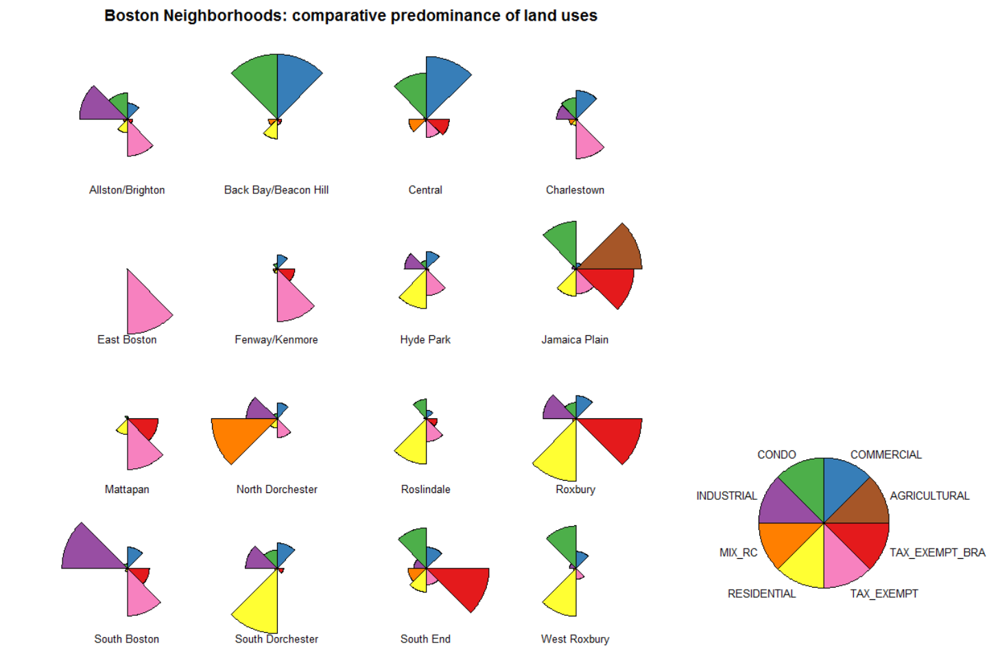
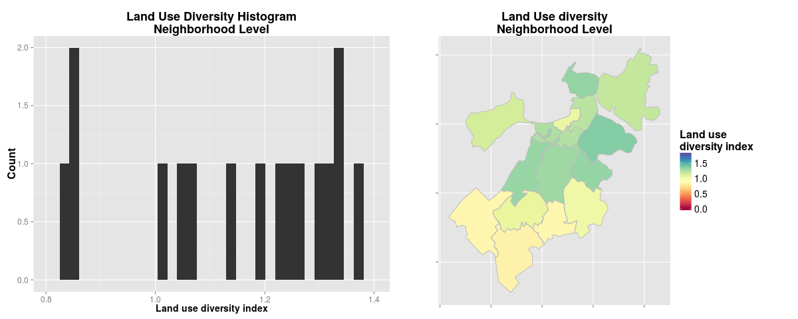
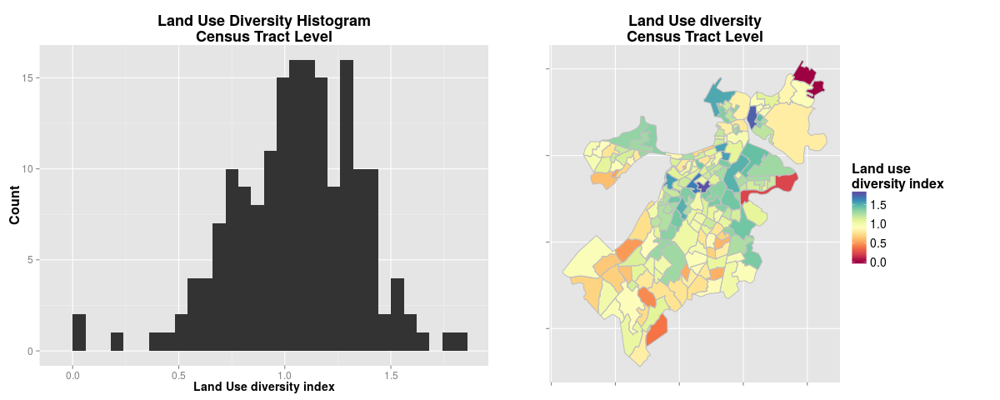
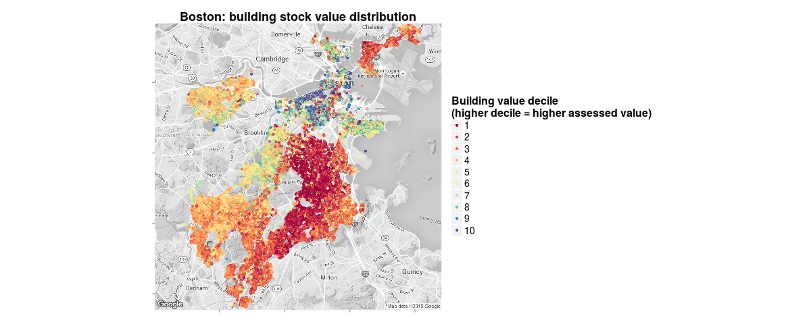
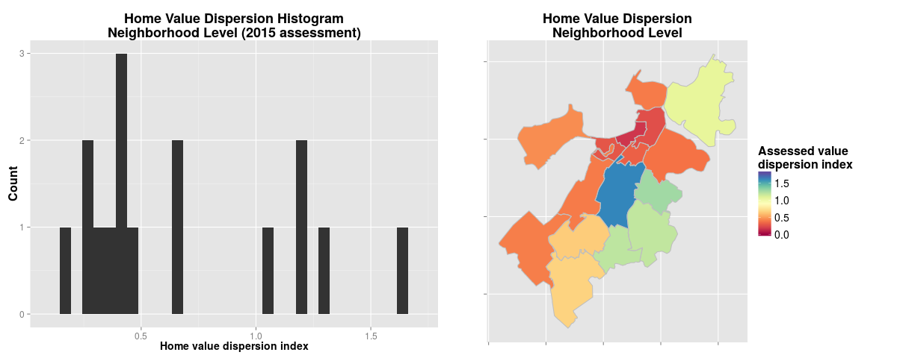
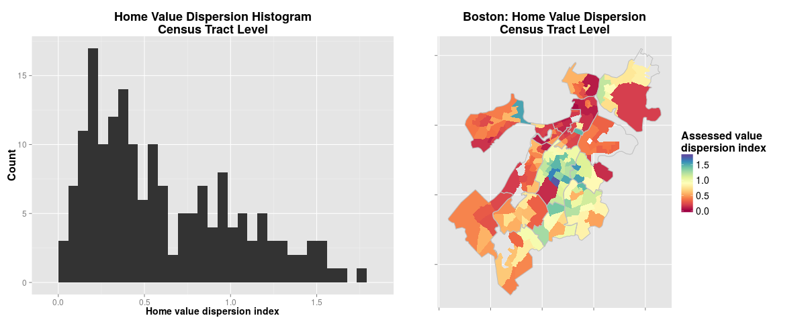
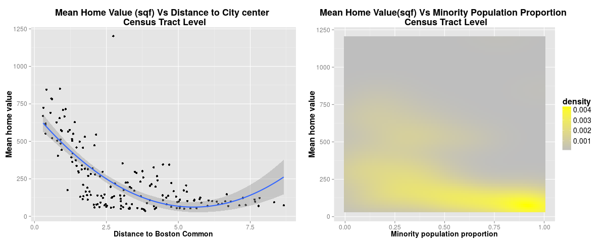

```{r echo=FALSE, message=FALSE}

#load the Tax Assesor dataset
TAdata <- read.csv('/home/havb/Dropbox/MSUI/Big Data for Cities - PPUA 5262 - 01/R/data/Tax Assessor/Tax Assessor 2015 - Data.csv', stringsAsFactors = FALSE) 


#Add a column with a 1 to 10 ranking (decile) for the parcel's sq foot value
library(dplyr)

TAdata <- mutate(TAdata,
                 BLDG_RANK = ceiling(rank(AV_BLDG_PER_SF,na.last="keep")/ 
                                       length(which(!is.na(AV_BLDG_PER_SF)))*10) )

# fix a single parcel in the entire dataset with LU = "XX", 
#a land use code that is not registered in the datasat dictionary. 
#Since the parcel is owned by a church, it's assumed a Tax Exempt parcel.

TAdata[TAdata$LU == 'XX',]$LU <- "E"

# Reduce land use categories

simplify_LU <- function(LU) {
  if (LU %in% c("R1", "R2", "R3", "R4", "RL", "A")) {
      return("RESIDENTIAL")
    } else if (LU %in% c("CM", "CP")) {
      return("CONDO")
    } else if (LU == "CD") {
      return("CONDO_UNIT")
    } else if (LU == "RC") {
      return("MIX_RC")
    } else if (LU %in% c("CC", "C", "CL")) {
      return("COMMERCIAL")
    } else if (LU == "AH") {
      return("AGRICULTURAL")
    } else if (LU == "I") {
      return("INDUSTRIAL")
    } else if (LU == "E") {
      return("TAX_EXEMPT")
    } else if (LU == "EA") {
      return("TAX_EXEMPT_BRA")
    } else {
      return(NA)
    }
}

#Create a new column by applying the simplifyLU function
TAdata <- transform(TAdata, SIMPLIFIED_LU = sapply(LU, simplify_LU))

# Identify homes

isHome <- function(SIMPLIFIED_LU) {
  if (SIMPLIFIED_LU %in% c("RESIDENTIAL", "CONDO_UNIT", "MIX_RC")) {
      return(1)
    } else {
      return(0)
    }
}

# Create a new column by applying the isHome function
TAdata <- transform(TAdata, HOME = sapply(SIMPLIFIED_LU, isHome))

# Calculate indices, by CT and neighborhood

library(vegan)

ct.lu.index <- summarise(group_by(filter(TAdata, !is.na(CT_ID_10)), CT_ID_10), 
                                        LAND_USE_DIV = diversity(table(SIMPLIFIED_LU)))

nb.lu.index <- summarise(group_by(filter(TAdata, !is.na(BRA_PD)), BRA_PD),
                         LAND_USE_DIV = diversity(table(SIMPLIFIED_LU)))

#Create a home value dispersion index, by CT and neighborhood


ct.hv.dispersion <- summarise(group_by(filter(TAdata, !is.na(CT_ID_10), HOME == 1), 
                                       CT_ID_10),
                              HOME_VALUE_DISP = var(BLDG_RANK, na.rm = TRUE)/
                                mean(BLDG_RANK, na.rm = TRUE))

nb.hv.dispersion <-summarise(group_by(filter(TAdata, !is.na(BRA_PD), HOME == 1), 
                                      BRA_PD),
                             HOME_VALUE_DISP = var(BLDG_RANK, na.rm = TRUE)/
                               mean(BLDG_RANK, na.rm = TRUE))

# Create a land use total area occupation matrices

library(tidyr)
# Remove Condo Units as we are now interested in neighborhood total areas and CU areas should not be summed
TAdata.no.condo.units <- filter(TAdata, LU != "CD")

# Group occupied area by neighborhood and land use
NB.LAND.USE <- summarise(group_by(TAdata.no.condo.units, BRA_PD,SIMPLIFIED_LU),
                         extension = sum(as.numeric(LAND_SF), na.rm = TRUE))

# Remove parcels with no neighborhood iformation
NB.LAND.USE <- filter(NB.LAND.USE, !is.na(BRA_PD))

# "Spread" the land use variables as one long row per neighborhood
NB.LAND.USE <- spread(NB.LAND.USE, SIMPLIFIED_LU, extension)

# Replace NAs with 0s
NB.LAND.USE[is.na(NB.LAND.USE)] <- 0

# Add a total area column
NB.LAND.USE <- transform(NB.LAND.USE, TOTAL_AREA = rowSums(NB.LAND.USE[2:9]))

# Tranform the lan use coverage areas into percentages
NB.LAND.USE[2:9] <- sapply(NB.LAND.USE[2:9], function(x) { round(x / NB.LAND.USE[10] * 100, 2)})

# Group occupied area by Census tract and land use
CT.LAND.USE <- summarise(group_by(filter(TAdata.no.condo.units, !is.na(CT_ID_10)), CT_ID_10,SIMPLIFIED_LU),
                         extension = sum(as.numeric(LAND_SF), na.rm = TRUE))

# "Spread" the land use variables as one long row per Census tract
CT.LAND.USE <- spread(CT.LAND.USE, SIMPLIFIED_LU, extension)

# Replace NAs with 0s
CT.LAND.USE[is.na(CT.LAND.USE)] <- 0

# Add a total area column
CT.LAND.USE <- transform(CT.LAND.USE, TOTAL_AREA = rowSums(CT.LAND.USE[2:9]))

# Tranform the land use coverage areas into percentages
CT.LAND.USE[2:9] <- sapply(CT.LAND.USE[2:9], function(x) { round(x / CT.LAND.USE[10] * 100, 2)})


# Load demographic data (CT level)

demographics <- read.csv("/home/havb/Dropbox/MSUI/Big Data for Cities - PPUA 5262 - 01/R/data/Census/Tract Census Data.csv")


# Combine Tax Assessor's and demographic data for correlation analysis

CTdata <- summarise(group_by(filter(TAdata, !is.na(CT_ID_10), HOME == 1), 
                                       CT_ID_10),
                        MEDIAN_HOME_VALUE = median(AV_BLDG_PER_SF, na.rm = TRUE),
                        MEAN_HOME_VALUE = mean(AV_BLDG_PER_SF, na.rm = TRUE),
                        MEAN_DIST_TO_DX = mean(DIST_TO_DX_MI, na.rm = TRUE))

CTdata <- merge(CTdata, ct.lu.index, all.y = TRUE)
CTdata <- merge(CTdata, ct.hv.dispersion, all.x = TRUE)
CTdata <- merge(CTdata, demographics, by = "CT_ID_10", all.x = TRUE)
CTdata$propmin <- (1 - CTdata$propwhite)

CTdata <- merge(CTdata, CT.LAND.USE, by = "CT_ID_10", all.x = TRUE)

```

# Introduction 

These diversity metrics are indices derived from the Boston Tax Assessor's dataset, in order to track the patterns of clustering and fragmentation of the city's built environment. 

The dataset contains specific data for all uniquely identifiable parcels in the City of Boston (168,146 instances) for the year 2015. Its 69 variables contain information related to parcel ownership, composition, and valuation, as well as physical characteristics of their buildings. The parcels are geo-referenced by lat-long coordinates and 2010 Census identifiers. 

These metrics are intended to complement measures of ethnic heterogeneity, as well as other demographic indicators, to assist in the analysis of urban segregation, as well as unequal access and use of urban space.

Preliminary hypothesis are: 

I) The spatial distribution of property value is correlated with its distance to the city center (as described in the classical concentric zone model), but also

II) There's a spatial clustering of similar levels of property value that does not follow a gradient associated with the property distance to the city center, but can be explained as function of social conditions in the surrounding area (i.e. ethnic and socioeconomic diversity) 

# Methodology

## Land Use Diversity 

The Tax Assessor's dataset includes 17 different types of land use, including 6 different codes for residential use at varying densities (single floor houses, two-floor, etc). The many different classifications for similar uses can result in  "artificially" high diversity scores in some cases, so a new auxiliary variable was created: SIMPLIFIED_LU. This variable reflects land use according to a simplified classification, with eight core uses: Residential, Commercial, Condo, Mixed Residential/Commercial, Agricultural, Industrial, Tax Exempt, and Tax Exempt by the Boston Redevelopment Authority (applies to parcels that are undergoing renovation projects).

Based on the simplified land use code, a land use matrix was compiled, showing the percentage of total parcel area each land use represents by neighborhood. This matrix was used to graphically represent each neighborhood's "identity" of land use distribution. A similar matrix was compiled at the Census tract level, in order to use the land use percentages for linear regression modelling.

In order to extract an analytic measure for the diversity of land uses present in a given city area, a mathematical tool was borrowed from the field of ecology, where diversity is calculated as a function of the variety of species in a given environment. For this particular scenario, land use codes were considered different "species" in the urban environment, and its variety in a particular area was used to estimate its diversity index. 

From a number of diversity algorithms with widespread use in ecology studies, Shannon's algorithm was chosen, as it is well suited for environments where some of the species (in our case, land uses like "agricultural") are rare. The Shannon index H can be calculated as:
 

$$H = - \sum_{p=1}^S p_i \log p_i $$
 
 
where $p_i$ is the proportion of species $i$ and $S$ is the total number of species.

Land Use diversity indices were created by aggregating land use data at both the neighborhood level and the inner census tract level, to show nested diversity distributions.

## Home Assessed Value Dispersion Indices

This measure required the definition of two auxiliary variables at the record level:

* building assessed value per square feet
* building square feet value decile  

By normalizing each building's assessed value by its area, we enabled the comparison between buildings of different sizes. By comparing this variable to classify buildings by decile, a "ranking" of building value was obtained. 

The classification by decile (instead of a different method, like Jenks natural breaks or equal intervals) was preferred as it is not affected by outliers, which are present in our data. 

Initially, all available buildings in the dataset were considered for the extraction of a general building value dispersion index. But, given that this variable is intended for comparison and regression analysis paired to demographic Census data, it was considered more appropriate to subset the data to select only those buildings that function as homes (i.e. only houses and condo units).

The mathematical expression for the home dispersion index is the coefficient of dispersion $D$, defined as the ratio of the variance $\sigma^2$ to the mean $\mu$:
 

$$ D = \frac{\sigma^2}{\mu} $$
 
 
This formula was applied to the aggregation of home value rankings by city area. Measuring the dispersion of value rankings, instead of directly measuring square feet value, solves the problem of outliers skewing the dispersion index.

Initially, diversity in home value was measured using Shannon's Diversity Index ( $- \sum_{p=1}^S p_i \log p_i$) but this presented problems as ecological diversity indexes are better suited for categorical variables instead of continuous ones; -i.e., a census tract with buildings equally distributed in the 1st, 5th and 10th decile will produce the same diversity index value as a tract with buildings equally distributed in the 8th, 9th and 10th decile, which we understand to be less "diverse" than the former. 

As with land use diversity, dispersion indices were created at both neighborhood and census tract level.

## Correlation analysis

The suspected correlation between distance to the city's center and property value follows the classical concentric zone model developed in the University of Chicago in the '20s. This zone model explains the patterns of urban land demand (and hence, value) as a function of its distance to the city's center, or central business district.  

A preliminary correlation analysis showed a strong relationship between a home's distance from the city center (calculated as distance between the parcel where the home is located and the Boston Common).

Once the predictive capacity of this basic, distance-based correlation analysis was examined, additional variables were incorporated into the model in order to improve its fitness, and to compare the relative effect of demographic vs value dispersion variables as additional predictors.


# Results

## Land use identity



This star plot lays out the land use distribution for each neighborhood according to our land use matrix. It somehow simplifies the difficult task of visualizing how similar -or different- 16 neighborhoods are based on 8 land use attributes.

Hosting the expansive Logan Airport, East Boston looks like little more than tax-exempt parcels. Back Bay and the Central district have a lot in common, because of the predominance of condo an commercial uses. Jamaica Plain is maybe the most diverse neighborhood in land uses, and the only one with agricultural parcels (the complete absence of this land use in other neighborhoods is what makes it so large for JP -this is a cross-comparison). North Dorchester takes the crown for mixed residential/commercial use -by far-, and South Rochester for residential. South Boston is where industrial parcels are most extended, followed by Allston/Brighton. Roxbury has the most amount of its surface covered by parcels under the Boston Redevelopment Authority tax exemption program, followed by the South End and Jamaica Plain. If we take out favorite outlier East Boston, Mattapan is the neighborhood with the least coverage of both commercial and condo land use, being in that sense like the inverse of Back Bay/Beacon Hill.

## Land use diversity Index 

### Neighborhood level



The neighborhood with the lowest land use diversity index is the very residential Hyde Park. The one with the highest value is South Boston, with its many industrial and commercial parcels.


### Census tract level



The individual Census tract with the lowest land use diversity index is the one at the city's north-east corner, where there are only two parcels, both commercial: the Suffolk Downs horse racetrack, and what I suspect is a small shop. The one with the highest index is located in Roxbury, right at the border with the South End.


## Spatial distribution of home assessed value



A reminder on the origin of this map: based on a the variable that measures building value normalized by building size ("AV_BLDG_PER_SF"), a ranking from 1 to 10 was extracted comparing  value of every home against the entirety of Boston's housing stock. That is to say, the ranking matches the value decile every building in our dataset belongs to. 

The map reflects neighborhood mean home values: Back Bay/Beacon Hill as the most valued, Dorchester, Mattapan, Roxbury as the least. However, mapping the ranking does provide further insights: it is remarkable how spatially concentrated the high value buildings are, and how close to each other lay the areas with the higher and lesser values.

As distance from the city center increases, a south-west/north-east polarization axis also becomes noticeable.

## Home assessed value dispersion index

### Neighborhood level




The neighborhood with the least amount of dispersion in its assessed value is, unsurprisingly, Back Bay/Beacon Hill. The neighborhoods with the highest difference between their highest and lowest assessed properties are Mattapan and Roxbury.


### Census tract level



The tract were property has the lower range of valuations is the portion of Back Bay next to the river. The tract with the higher dispersion is a clear outlier, with an index of 6.4 (all other tracts go from 0.2 up to 2.6). This tract is the previously mentioned one where the Suffolk Downs racetrack ("live horse racing landmark since 1935") and a small commercial structure represent the only parcels in the area, whose markedly different assessed values explain the resulting index.

## Predicting assessed home value with regression analysis

As hypothesized, both the distance from the city center and certain demographic variables (proportion of minority population in particular) exhibit a strong and statistically significant correlation with the mean home value of a census tract.



The left plot is shows a not-quite-linear distribution of home values as distance increases: buildings with really low value rankings are frequent at mid-distance from the center, but start to decrease as distance increases. This behavior is better represented with a quadratic regression line.
The right plot shows that low-value homes cluster tightly around high percentages of minority population (bottom-right corner of the graphic); in our tests, the proportion of minority population is by far the most significantly correlated demographic variable. (Ethnic Diversity, curiously enough, is correlated with home value but its effect is negligible).  

In fact, using only this two variables (_proportion of minority population_ and squared _distance to Boston Common_), a linear regression model can be defined such as it shields an adjusted-$R^2$ value of more than 60% with a p-vale < 0.001 (_Table 1_).

```{r echo=FALSE, results="asis", message=FALSE}
library(stargazer)
options(scipen = 5)

regression.1 <- lm(data = CTdata, 
                           MEAN_HOME_VALUE ~ MEAN_DIST_TO_DX + I(MEAN_DIST_TO_DX^2) +
                     propmin)

stargazer(regression.1, align=TRUE, no.space=TRUE, 
          dep.var.labels=c("Mean home value"), 
          covariate.labels=c("Mean distance to Boston Common",
                             "Mean distance to Boston Common (squared component)",
                             "Proportion of minority population"),
          omit.stat=c("LL","ser","f"), header=FALSE, type = "latex")
```

### Adding land use diversity variables to the regression model

In order to add nuance to the regression model, the relationship between Census tract mean home value and land use diversity index was included in the regression model for analysis. A statistically significant, inversely correlated relationship was found between land use diversity and home value, although not substantial. 

The relative predominance of different types of land use was also analysed. A correlation test was run for mean home value against all land use variables in the land use identity matrix. The results were unexpected: when controlling for our already accepted variables (distance, minority population, land use diversity) the percentage of industrial land in a Census tract has no effect on its home values, contrary to our expectations (since is generally accepted that industrial activity degrades quality of life in nearby residential areas). The percentage of residential land use did not show an effect either; in fact, the only land uses with a significant effect are _mixed residential/commercial_ and _Condo_ (_Table 2_).


```{r echo=FALSE, results="asis"}
regression.2 <- lm(data = CTdata, 
                           MEAN_HOME_VALUE ~ MEAN_DIST_TO_DX + I(MEAN_DIST_TO_DX^2) +
                     propmin + LAND_USE_DIV + MIX_RC + CONDO)

stargazer(regression.2, align=TRUE, no.space=TRUE, 
          dep.var.labels=c("Mean home value"), 
          covariate.labels=c("Mean distance to Boston Common",
                             "Mean distance to Boston Common (squared component)",
                             "Proportion of minority population",
                             "Land use diversity",
                             "Percentage of mixed R/C land use",
                             "Percentage of condo land use"),
          omit.stat=c("LL","ser","f"), header=FALSE, type = "latex")
```

### Adding the home value diversity/dispersion variable to the regression model

Our home value dispersion variable acts as an "affordability diversity" index, as it shows how the range between the cheapest and the most expensive houses in a given Census tract is. Its inclusion in our value prediction model resulted in a clear fit improvement, but what is surprising is its effect on the most predictive demographic variable: __when controlling for home value dispersion, minority population halves its effect, and looses statistical significance__ (_Table 3_).

For regression purposes, using a variable extracted from home value data (dispersion) to predict another one calculated from the same source (mean) it's not a good idea, so the regression model presented in __Table 2_ with a non trivial 77% predictive capacity, will be our preferred one.

```{r echo=FALSE, results="asis"}
regression.3 <- lm(data = CTdata, 
                           MEAN_HOME_VALUE ~ MEAN_DIST_TO_DX + I(MEAN_DIST_TO_DX^2) +
                     MIX_RC + CONDO + propmin + HOME_VALUE_DISP)

regression.4 <- lm(data = CTdata, 
                   MEAN_HOME_VALUE ~ MEAN_DIST_TO_DX + I(MEAN_DIST_TO_DX^2) + 
                     MIX_RC + CONDO + HOME_VALUE_DISP)

stargazer(regression.3, regression.4, align=TRUE, no.space=TRUE, 
          dep.var.labels=c("Mean home value"), 
          covariate.labels=c("Mean distance to Boston Common",
                             "Mean distance to Boston Common (squared component)",
                             "Percentage of mixed R/C land use",
                             "Percentage of condo land use",
                             "Proportion of minority population",
                             "Home value dispersion"),
          omit.stat=c("LL","ser","f"), header=FALSE, type = "latex")
```

Here it should be pointed out that the home value dispersion coefficient is paired with a minus sign: an increase in value dispersion results in a decrease in mean home value. So tracts with low dispersion indexes tend to be those where property has a lower valuation. 

This leads to another surprising finding, that refutes what could be considered common sense: in our tests, Census tract median income is not a good predictor for mean home value, with an adjusted $R^2 = 0.052$; while the dispersion index does show a substantial correlation - adjusted $R^2 = 0.35$.

The home value dispersion index also shows a statistically significant correlation with both the proportion of minority population and ethnic heterogeneity in a given Census tract. While the correlation effect is modest for ethnic heterogeneity, it is substantial for minority population, as would be expected under the light of our previous results (_Table 4_).

```{r echo=FALSE, results="asis"}
regression.5 <- lm(data = CTdata, 
                                     propmin ~ HOME_VALUE_DISP)

regression.6 <- lm(data = CTdata, 
                                     EthHet ~ HOME_VALUE_DISP)


stargazer(regression.5, regression.6, align=TRUE, no.space=TRUE, 
          dep.var.labels=c("Proportion of minority population", "Ethnic heterogeneity index"),
          covariate.labels=c("Home value dispersion"),
          omit.stat=c("LL","ser","f"), header=FALSE, type = "latex")
```


# Conclusion

We've seen how the idiosyncratic land use and value dispersion patterns of Boston's urban landscape are obscured by a relative homogeneity at the neighborhood level. But when "zooming in" at the Census tract level the variety of internal configurations is revealed, exposing a complexity that is lost at higher levels of aggregation. 

The City's profound ethnic segregation is reflected by the spatial distribution of home values, organized in highly polarized configuration where zones of high and low assessed values are in close proximity but at the same time clearly demarcated. This level of segregation, along with its accompanying income gap, explains why the mean home value in a Census tract can be reasonably predicted using little more than its distance from the city center and its proportion of minority population.  

There is also a remarkable correlation between our built environment diversity indices and demographic variables, particularly minority population proportion and ethnic diversity. This correlation is so significant that the inclusion of the home value dispersion index in a linear regression model for mean home value cancels the statistical significance of the minority population variable.

Having observed that minorities tend to congregate in tracts where there is a wider range of affordability in home values, the simplest interpretation is that the Caucasian population (which is to say, the counterpart of the minority population) lives in areas where home value dispersion is low. Since areas with low value dispersion are correlated with higher assessed values, this contributes to the notion that the spatial segregation of minorities is reinforced by the high cost of housing in certain areas acing as a separation barrier.

The implication for public policy seems to be that in order to fight segregation, the options are either closing the income gap between ethnic groups, or preventing the consolidation of uniformly high cost areas that minorities cannot access by simple lack of means. As far as city governments are concerned, both are challenging, although the public housing initiatives devised to address the later immediately come to mind. Based on the city's current state of affairs, it is clear that much more needs to be done to guarantee equal access to the urban space.

# Appendix: Annotated R Syntax


```{r eval=FALSE}

#load the Tax Assesor dataset
TAdata <- read.csv('Tax Assessor 2015 - Data.csv', stringsAsFactors = FALSE) 


#Add a column with a 1 to 10 ranking (decile) for the parcel's sq foot value
library(dplyr)

TAdata <- mutate(TAdata,
                 BLDG_RANK = ceiling(rank(AV_BLDG_PER_SF,na.last="keep")/ 
                                       length(which(!is.na(AV_BLDG_PER_SF)))*10) )

# fix a single parcel in the entire dataset with LU = "XX", 
#a land use code that is not registered in the datasat dictionary. 
#Since the parcel is owned by a church, it's assumed a Tax Exempt parcel.

TAdata[TAdata$LU == 'XX',]$LU <- "E"

# Reduce land use categories

simplify_LU <- function(LU) {
  if (LU %in% c("R1", "R2", "R3", "R4", "RL", "A")) {
      return("RESIDENTIAL")
    } else if (LU %in% c("CM", "CP")) {
      return("CONDO")
    } else if (LU == "CD") {
      return("CONDO_UNIT")
    } else if (LU == "RC") {
      return("MIX_RC")
    } else if (LU %in% c("CC", "C", "CL")) {
      return("COMMERCIAL")
    } else if (LU == "AH") {
      return("AGRICULTURAL")
    } else if (LU == "I") {
      return("INDUSTRIAL")
    } else if (LU == "E") {
      return("TAX_EXEMPT")
    } else if (LU == "EA") {
      return("TAX_EXEMPT_BRA")
    } else {
      return(NA)
    }
}

#Create a new column by applying the simplifyLU function
TAdata <- transform(TAdata, SIMPLIFIED_LU = sapply(LU, simplify_LU))

# Identify homes

isHome <- function(SIMPLIFIED_LU) {
  if (SIMPLIFIED_LU %in% c("RESIDENTIAL", "CONDO_UNIT", "MIX_RC")) {
      return(1)
    } else {
      return(0)
    }
}

# Create a new column by applying the isHome function
TAdata <- transform(TAdata, HOME = sapply(SIMPLIFIED_LU, isHome))

# Calculate indices, by CT and neighborhood

library(vegan)

ct.lu.index <- summarise(group_by(filter(TAdata, !is.na(CT_ID_10)), CT_ID_10), 
                                        LAND_USE_DIV = diversity(table(SIMPLIFIED_LU)))

nb.lu.index <- summarise(group_by(filter(TAdata, !is.na(BRA_PD)), BRA_PD),
                         LAND_USE_DIV = diversity(table(SIMPLIFIED_LU)))

#Create a home value dispersion index, by CT and neighborhood


ct.hv.dispersion <- summarise(group_by(filter(TAdata, !is.na(CT_ID_10), HOME == 1), 
                                       CT_ID_10),
                              HOME_VALUE_DISP = var(BLDG_RANK, na.rm = TRUE)/
                                mean(BLDG_RANK, na.rm = TRUE))

nb.hv.dispersion <-summarise(group_by(filter(TAdata, !is.na(BRA_PD), HOME == 1), 
                                      BRA_PD),
                             HOME_VALUE_DISP = var(BLDG_RANK, na.rm = TRUE)/
                               mean(BLDG_RANK, na.rm = TRUE))

# Create land use total area occupation matrices

library(tidyr)
# Remove Condo Units as we are now interested in neighborhood total areas 
# and CU areas should not be summed
TAdata.no.condo.units <- filter(TAdata, LU != "CD")

# Group occupied area by neighborhood and land use
NB.LAND.USE <- summarise(group_by(TAdata.no.condo.units, BRA_PD,SIMPLIFIED_LU),
                         extension = sum(as.numeric(LAND_SF), na.rm = TRUE))

# Remove parcels with no neighborhood iformation
NB.LAND.USE <- filter(NB.LAND.USE, !is.na(BRA_PD))

# "Spread" the land use variables as one long row per neighborhood
NB.LAND.USE <- spread(NB.LAND.USE, SIMPLIFIED_LU, extension)

# Replace NAs with 0s
NB.LAND.USE[is.na(NB.LAND.USE)] <- 0

# Add a total area column
NB.LAND.USE <- transform(NB.LAND.USE, TOTAL_AREA = rowSums(NB.LAND.USE[2:9]))

# Tranform the lan use coverage areas into percentages
NB.LAND.USE[2:9] <- sapply(NB.LAND.USE[2:9], 
                           function(x) { round(x / NB.LAND.USE[10] * 100, 2)})

# Group occupied area by Census tract and land use
CT.LAND.USE <- summarise(group_by(filter(TAdata.no.condo.units, !is.na(CT_ID_10)),
                                  CT_ID_10,SIMPLIFIED_LU),
                         extension = sum(as.numeric(LAND_SF), na.rm = TRUE))

# "Spread" the land use variables as one long row per Census tract
CT.LAND.USE <- spread(CT.LAND.USE, SIMPLIFIED_LU, extension)

# Replace NAs with 0s
CT.LAND.USE[is.na(CT.LAND.USE)] <- 0

# Add a total area column
CT.LAND.USE <- transform(CT.LAND.USE, TOTAL_AREA = rowSums(CT.LAND.USE[2:9]))

# Tranform the land use coverage areas into percentages
CT.LAND.USE[2:9] <- sapply(CT.LAND.USE[2:9], 
                           function(x) { round(x / CT.LAND.USE[10] * 100, 2)})


# Load demographic data (CT level)

demographics <- read.csv("Tract Census Data.csv")


# Combine Tax Assessor's and demographic data for correlation analysis

CTdata <- summarise(group_by(filter(TAdata, !is.na(CT_ID_10), HOME == 1), 
                                       CT_ID_10),
                        MEDIAN_HOME_VALUE = median(AV_BLDG_PER_SF, na.rm = TRUE),
                        MEAN_HOME_VALUE = mean(AV_BLDG_PER_SF, na.rm = TRUE),
                        MEAN_DIST_TO_DX = mean(DIST_TO_DX_MI, na.rm = TRUE))

CTdata <- merge(CTdata, ct.lu.index, all.y = TRUE)
CTdata <- merge(CTdata, ct.hv.dispersion, all.x = TRUE)
CTdata <- merge(CTdata, demographics, by = "CT_ID_10", all.x = TRUE)
CTdata$propmin <- (1 - CTdata$propwhite)

CTdata <- merge(CTdata, CT.LAND.USE, by = "CT_ID_10", all.x = TRUE)

```


```{r eval=FALSE}
####################################################################################
# REGRESSION MODELS
####################################################################################

regression.1 <- lm(data = CTdata, 
                           MEAN_HOME_VALUE ~ MEAN_DIST_TO_DX + I(MEAN_DIST_TO_DX^2) + 
                     propmin)

regression.2 <- lm(data = CTdata, 
                           MEAN_HOME_VALUE ~ MEAN_DIST_TO_DX + I(MEAN_DIST_TO_DX^2) +
                     propmin + LAND_USE_DIV + MIX_RC + CONDO)

regression.3 <- lm(data = CTdata, 
                           MEAN_HOME_VALUE ~ MEAN_DIST_TO_DX + I(MEAN_DIST_TO_DX^2) +
                     MIX_RC + CONDO + HOME_VALUE_DISP + propmin + EthHet)

regression.4 <- lm(data = CTdata, 
                   MEAN_HOME_VALUE ~ MEAN_DIST_TO_DX + I(MEAN_DIST_TO_DX^2) + 
                     MIX_RC + CONDO + HOME_VALUE_DISP)

regression.5 <- lm(data = CTdata, 
                                     propmin ~ HOME_VALUE_DISP)

regression.6 <- lm(data = CTdata, 
                                     EthHet ~ HOME_VALUE_DISP)

```


```{r eval=FALSE}
####################################################################################
# PLOTS
####################################################################################

require(ggplot2)

my.plot.theme <- theme(plot.title = element_text(size = 18, face="bold"),
                       axis.title.x = element_text(size = 14, face = "bold"),
                       axis.title.y = element_text(size = 16, face = "bold"),
                       axis.text.x = element_text(size = 12),
                       axis.text.y = element_text(size = 12),
                       legend.title = element_text(size = 16, face = "bold"),
                       legend.text = element_text(size = 14))

#Histogram - Land use diversity at the neighborhood level


hist1 <- ggplot(nb.lu.index, aes(x = LAND_USE_DIV)) + geom_histogram() + 
  labs(title = "Land Use Diversity Histogram\nNeighborhood Level", 
       x = "Land use diversity index", y = "Count") + 
  my.plot.theme


# Histogram: Land use diversity at the census tract level

hist2 <- ggplot(ct.lu.index, aes(x = LAND_USE_DIV)) + geom_histogram() +
  labs(title = "Land Use Diversity Histogram\nCensus Tract Level", 
       x = "Land Use diversity index", y = "Count") +
  my.plot.theme 


#Histogram - Home value dispersion at the neighborhood level

hist3 <- ggplot(nb.hv.dispersion, aes(x = HOME_VALUE_DISP)) + geom_histogram() + 
  labs(title = "Home Value Dispersion Histogram\nNeighborhood Level (2015 assessment)", 
       x = "Home value dispersion index", y = "Count") +
  my.plot.theme


# Histogram: Home value dispersion at the census tract level

hist4 <- ggplot(ct.hv.dispersion, aes(x = HOME_VALUE_DISP)) + geom_histogram() + 
  labs(title = "Home Value Dispersion Histogram\nCensus Tract Level", 
       x = "Home value dispersion index", y = "Count") + 
  my.plot.theme 


# 2D density: 

dens1 <- ggplot(data = CTdata, aes(x = propmin, y = MEAN_HOME_VALUE)) +
  stat_density2d(aes(fill=..density..), geom="tile", contour=FALSE) + 
  scale_fill_gradient(low = "grey", high = "yellow") + 
  labs(title = "Mean Home Value (sqf) Vs Minority Population Proportion \n 
       Census Tract Level", 
       x = "Minority population proportion", y = "Mean home value") + 
  my.plot.theme 


# Regression curve:

regr1 <- ggplot(data = CTdata, aes(x = MEAN_DIST_TO_DX, y = MEAN_HOME_VALUE)) +
  geom_point() + stat_smooth(method = "lm", formula = y ~ x + I(x^2), size = 1) +
  labs(title = "Mean Home Value (sqf) Vs Distance to City center \n Census Tract Level", 
       x = "Distance to Boston Common", y = "Mean home value") 
+ my.plot.theme 


#Star plot

row.names(NB.LAND.USE) <- NB.LAND.USE$BRA_PD
NB.LAND.USE <- NB.LAND.USE[2:10]
#we plot everything except column 10 (total area)
starplot1 <- stars(NB.LAND.USE[1:8], flip.labels = FALSE, 
                   key.loc = c(13, 3),  draw.segments=TRUE, 
                   main = "Boston Neighborhoods: comparative predominance of land uses",
                   col.segments = c("#A65628","#377EB8","#4DAF4A","#984EA3",
                                    "#FF7F00","#FFFF33", "#F781BF","#E41A1C")) 
```

```{r eval=FALSE}
####################################################################################
#MAPS
####################################################################################

#Load a shape file with the geographic extents of Boston's census tracts, 
#turn it into a data frame, and merge it with our data
library(rgdal)
library(maptools)
gpclibPermit()

tracts_geo <- readOGR(dsn = 'shapefiles/Tracts_Boston_2015_BARI', 'Tracts_Boston BARI')
tracts_geo <- fortify(tracts_geo, region = "CT_ID_10")
tracts_geo <- merge(tracts_geo, CTdata, by.x = 'id', 
                    by.y = 'CT_ID_10', all.x = TRUE)


#Now at the neighborhood level

neighborhoods_geo <- readOGR(dsn = 'shapefiles/Neighborhoods_Boston_2015',
                             'Neighborhoods_Boston_2015')
neighborhoods_geo <- fortify(neighborhoods_geo, region = "BRA_PD")

neighborhoods_geo <- merge(neighborhoods_geo, nb.lu.index, by.x = 'id', 
                           by.y = 'BRA_PD', all.x = TRUE)
neighborhoods_geo <- merge(neighborhoods_geo, nb.hv.dispersion, by.x = 'id', 
                           by.y = 'BRA_PD', all.x = TRUE)

require(ggmap)

my.map.theme <- theme(plot.title = element_text(size = 18, face="bold"),
                      axis.title.x = element_blank(),
                      axis.title.y = element_blank(),
                      axis.text.x = element_blank(),
                      axis.text.y = element_blank(),
                      legend.title = element_text(size = 16, face = "bold"),
                      legend.text = element_text(size = 14))


Boston <- get_map(location=c(left = -71.193799, 
                             bottom = 42.11, 
                             right = -70.985746, 
                             top = 42.515), 
                  color = "bw")

base<- ggmap(Boston)

# The spatial distribution of Boston's home value ranking

map0 <- base +
  geom_point(data=TAdata[TAdata$HOME ==1,], 
  aes(x = X, y = Y, color = as.factor(BLDG_RANK), alpha = .5)) + 
  scale_colour_brewer(type = "div", palette = 9) + 
  labs(title = "Boston: building stock value distribution", 
  color='Building value decile \
  (higher decile = higher assessed value)', alpha = FALSE) + 
    guides(alpha = FALSE) + 
    my.map.theme 


library("RColorBrewer")
myPalette <- colorRampPalette(brewer.pal(11, "Spectral"))


#A map of Boston's land use diversity, by neighborhood

map1 <- ggplot() + 
  geom_polygon(aes(x=long, y=lat, group=id, fill=LAND_USE_DIV),
                        data=neighborhoods_geo) + 
  geom_path(aes(x=long, y=lat, group=group), color = 'gray', data=neighborhoods_geo) +
  scale_fill_gradientn(colours = myPalette(100), limits=c(0, 1.82)) +
  labs(title = "Land Use diversity\nNeighborhood Level", 
       fill='Land use\ndiversity index') + 
  coord_map() + 
  my.map.theme 


# A map of Boston's land use diversity, by census tract

map2 <- ggplot() + 
  geom_polygon(aes(x=long, y=lat, group=id, fill=LAND_USE_DIV),
                        data=tracts_geo) + 
  geom_path(aes(x=long, y=lat, group=group), color = 'gray', data=tracts_geo) +
  scale_fill_gradientn(colours = myPalette(100), limits=c(0, 1.82)) +
  labs(title = "Land Use diversity\nCensus Tract Level", 
       fill='Land use\ndiversity index') + 
  coord_map() + 
  my.map.theme 


#A map of Boston's home value dispersion, by neighborhood

map3 <- ggplot() + 
  geom_polygon(aes(x=long, y=lat, group=id, fill=HOME_VALUE_DISP),
                        data=neighborhoods_geo) + 
  geom_path(aes(x=long, y=lat, group=group), color = 'gray', data=neighborhoods_geo) +
  scale_fill_gradientn(colours = myPalette(100), limits=c(0, 1.8)) +
  labs(title = "Home Value Dispersion\nNeighborhood Level", 
       fill='Assessed value\ndispersion index') + 
  coord_map() + 
  my.map.theme 


#A map of Boston's home value dispersion, by census tract 

map4 <- ggplot() + 
  geom_polygon(aes(x=long, y=lat, group=id, fill=HOME_VALUE_DISP),
                        data = filter(tracts_geo, totalpop > 100)) + 
  geom_path(aes(x=long, y=lat, group=group), color = 'gray', data=neighborhoods_geo) +
  scale_fill_gradientn(colours = myPalette(100), limits=c(0, 1.8)) +
  labs(title = "Boston: Home Value Dispersion\nCensus Tract Level", 
       fill='Assessed value\ndispersion index') + 
  coord_map() + 
  my.map.theme 

```


```{r eval=FALSE, echo=FALSE}

library(Rmisc)

png(file = '/home/havb/Dropbox/MSUI/Big Data for Cities - PPUA 5262 - 01/R/workbench/Assignments/Final/1.png', width = 1200)

multiplot(hist1, map1, cols = 2)

dev.off()

png(file = '/home/havb/Dropbox/MSUI/Big Data for Cities - PPUA 5262 - 01/R/workbench/Assignments/Final/2.png', width = 1200)

multiplot(hist2, map2, cols = 2)

dev.off()

png(file = '/home/havb/Dropbox/MSUI/Big Data for Cities - PPUA 5262 - 01/R/workbench/Assignments/Final/3.png', width = 1200)

multiplot(hist3, map3, cols = 2)

dev.off()

png(file = '/home/havb/Dropbox/MSUI/Big Data for Cities - PPUA 5262 - 01/R/workbench/Assignments/Final/4.png', width = 1200)

multiplot(hist4, map4, cols = 2)

dev.off()

png(file = '/home/havb/Dropbox/MSUI/Big Data for Cities - PPUA 5262 - 01/R/workbench/Assignments/Final/regrcandidates.png', width = 1200)

multiplot(regr1, dens1, cols = 2)

dev.off()


png(file = '/home/havb/Dropbox/MSUI/Big Data for Cities - PPUA 5262 - 01/R/workbench/Assignments/Final/starplot1.png', width = 1200)

starplot1

dev.off()

png(file = '/home/havb/Dropbox/MSUI/Big Data for Cities - PPUA 5262 - 01/R/workbench/Assignments/Final/valuerankmap.png', width = 1200)

map0

dev.off()


# A map of Boston's minority proportion, by census tract 

mapmin <- ggplot() + 
  geom_polygon(aes(x=long, y=lat, group=id, fill=propmin),
                        data = filter(tracts_geo, totalpop > 100)) + 
  geom_path(aes(x=long, y=lat, group=group), color = 'gray', data=neighborhoods_geo) +
  scale_fill_gradientn(colours = myPalette(100), limits=c(0, 1)) +
  labs(title = "Boston: Proportion of minority population\nCensus Tract Level", 
       fill='Minority population\nproportion') + 
  coord_map() + 
  my.map.theme 


png(file = '/home/havb/Dropbox/MSUI/Big Data for Cities - PPUA 5262 - 01/R/workbench/Assignments/Final/prezmap.png', width = 1200)

multiplot(map4, mapmin, cols = 2)


dev.off()


###### GRAPH PRED VS OBS #######

CTdata2 <- CTdata[order(CTdata$MEAN_DIST_TO_DX),]
CTdata2$CT <- (1:nrow(CTdata2))

regression.plot <- lm(data = CTdata2, 
                           MEAN_HOME_VALUE ~ MEAN_DIST_TO_DX + I(MEAN_DIST_TO_DX^2) +
                     propmin + LAND_USE_DIV + MIX_RC + CONDO)

mycoefs <- coef(regression.plot)

# My predictions vector
Y.predictions <- fitted(regression.plot)

observed.vs.predicted <- cbind(distance_from_city_center = CTdata2$CT, 
                                 mean_home_value = CTdata$MEAN_HOME_VALUE,
                                 prediction = Y.predictions)

observed.vs.predicted <- as.data.frame(observed.vs.predicted)

prediction <- ggplot(observed.vs.predicted, aes(distance_from_city_center)) + 
  geom_point(aes(y = mean_home_value, colour = "Observed"), size = 5) + 
  geom_point(aes(y = prediction, colour = "Predicted"), size = 5) +
  labs(title = "Boston: Census tract mean home value", colour='mean_home_value') +
  my.plot.theme

png(file = '/home/havb/Dropbox/MSUI/Big Data for Cities - PPUA 5262 - 01/R/workbench/Assignments/Final/prediction.png', width = 1200)

prediction


dev.off()


```


