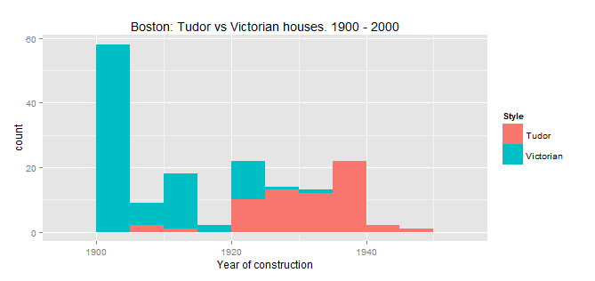
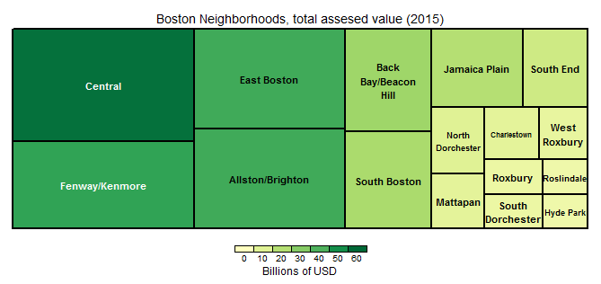
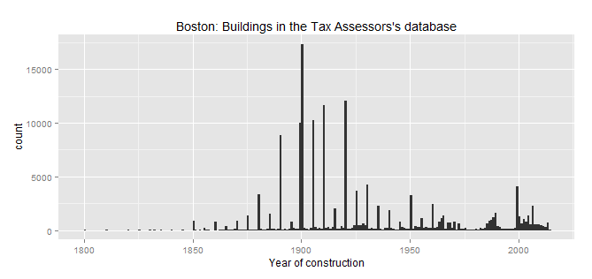

#What is this dataset about?

Specific data for all uniquely identifiable parcels in the City of Boston (168,146 instances) for the year 2015. Its 69 variables contain information related to parcel ownership, composition, and valuation, as well as physical characteristics of their buildings. The parcels are geo-referenced by lat-long coordinates and 2010 Census identifiers. 

#What can I find here? (some examples)

##The age and location of the oldest extant building in Boston

Is at 21-23 Greenview Ave (Jamaica Plain), built in 1700. It's on sale at the time of this writing: according to the listing, "Our Seller was told it was once a stable to one of JP's grand homes, and was moved to this location."

##The periods were certain architectural styles were in fashion

The popularity of diverse architectural styles, (like Victorian vs Tudor) can be easily compared:

##Who owns the most real state property, by assessed value, in Boston

It's the Massachusetts Port Authority, with more than USD 38.78 billion to its name -almost 12% of all the assessed value in the city. The top five owners is completed with General Hospital Corp (#2), Boston College (#3), Harvard College (#4), and the City of Boston (#5).

##Which neighborhood accumulates more assessed value than any other

It's the downtown, with more than $57 billion. The neighborhood that contains the least amount of assessed value is Hyde Park ($4.27 billion):

 

##What is the cheapest neighborhood to buy real state (by assessed land value)

It's Hyde Park, where land has a mean value of less than $19 per square feet. On the other end lies Back Bay / Beacon Hill, with a mean value of more than $490

##When was the city "booming"

Clearly, it had its boom period at the turn of the 20th century:

 