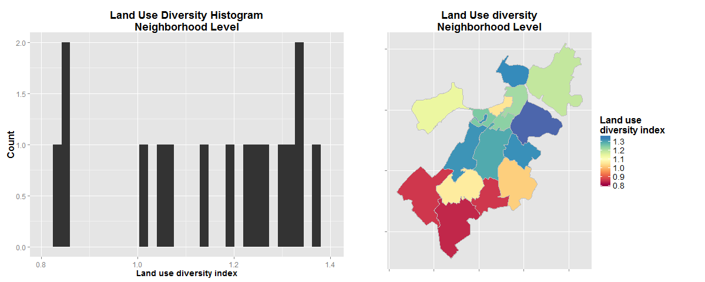
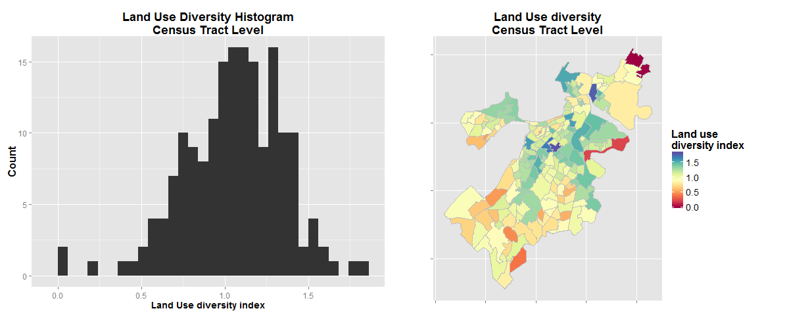
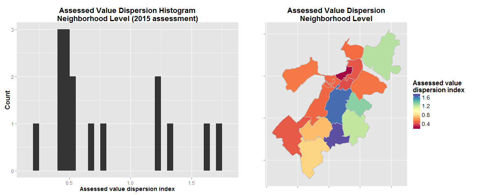
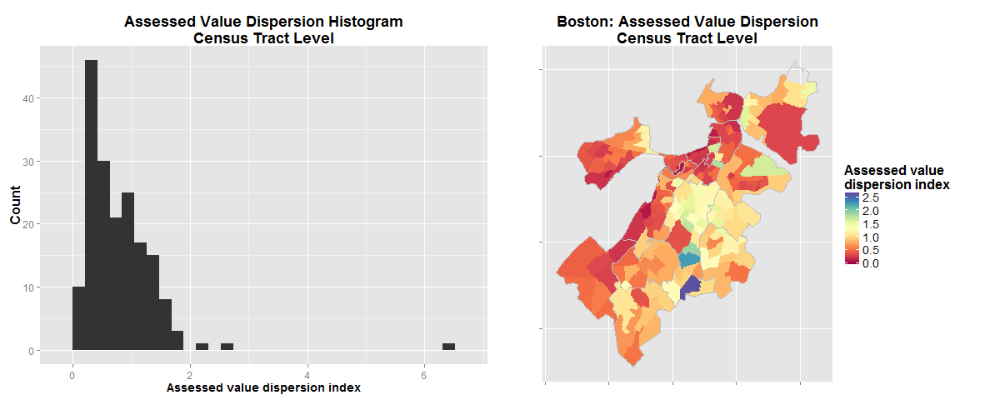

#Overview 

These diversity metrics are indices derived from the Boston Tax Assessor's dataset, in order to track the patterns of clustering and fragmentation of the city's built environment. 

The metrics are intended to complement measures of ethnic heterogeneity, as well as other demographic indicators, to assist in the analysis of urban segregation and unequal access and use of urban space.

# Land Use Diversity Indices

The Tax Assessor's dataset includes 17 different types of land use, including 6 different codes for residential use at varying densities (single floor houses, two-floor, etc). The many different classifications for similar uses can result in  "artificially" high diversity scores in some cases, so a new auxiliary variable was created: SIMPLIFIED_LU. This variable reflects land use according to a simplified classification, with eight core uses: Residential, Commercial, Condo, Mixed Residential/Commercial, Agricultural, Industrial, Tax Exempt, and Tax Exempt by the Boston Redevelopment Authority (applies to parcels that are undergoing renovation projects).

To measure the diversity of land uses present in a given city area, a mathematical tool was borrowed from the field of ecology, where diversity is calculated as a function of the variety of species in a given environment. For this particular scenario, land use codes were considered different "species" in the urban environment, and its variety in a particular area was used to estimate its diversity index. 

From a number of diversity algorithms with widespread use in ecology studies, Shannon's algorithm was chosen, as it is well suited for environments where some of the species (in our case, land uses like "agricultural") are rare. The Shannon index H can be calculated as:
 

$$H = - \sum_{p=1}^S p_i \log p_i $$
 
 
where $p_i$ is the proportion of species $i$ and $S$ is the total number of species.

Land Use diversity indices were created by aggregating land use data at both the neighborhood level and the inner census tract level, to show nested diversity distributions:

## Land use diversity Index (Neighborhood level)

__Summary:__ 

 Minimum:      0.8385  
 1st Quartile: 1.0455  
 Median:       1.2105
 Mean:         1.1522  
 3rd Quartile: 1.3097  
 Maximum:      1.3764
 



The neighborhood with the lowest land use diversity index is the very residential Hyde Park. The one with the highest value is South Boston, with its many industrial and commercial parcels.


## Land use diversity index (Census tract level)

__Summary:__ 

 Minimum:       0.0000  
 1st Quartile:  0.8842  
 Median:        1.0772  
 Mean:          1.0542  
 3rd Quartile:  1.2662  
 Maximum:       1.8018  
 



The individual Census tract with the lowest land use diversity index is the one at the city's north-east corner, where there are only two parcels, both commercial: the Suffolk Downs horse racetrack, and what I suspect is a small shop. The one with the highest index is located in Roxbury, right at the border with the South End.

# Built Environment Assessed Value Dispersion Indices

This measure required the definition of two auxiliary variables at the record level:

* building assessed value per square feet
* building square feet value decile  

By normalizing each building's assessed value by its area, we enable the comparison between buildings of different sizes. By comparing this variable to classify buildings by decile, a "ranking" of building value was obtained. 

The classification by decile (instead of a different method, like Jenks natural breaks or equal intervals) was preferred as it is not affected by outliers, which are present in our data. 

The Building value dispersion index was obtained by applying the coefficient of dispersion $D$, defined as the ratio of the variance $\sigma^2$ to the mean $\mu$:
 

$$ D = \frac{\sigma^2}{\mu} $$
 
 
This formula was applied to the aggregation of building value rankings by city area. Measuring the dispersion of value rankings, instead of directly measuring square feet value, solves the problem of outliers skewing the dispersion index.

Initially, diversity in building value was measured using Shannon's Diversity Index ( $- \sum_{p=1}^S p_i \log p_i$) but this presented problems as ecological diversity indexes are better suited for categorical variables instead of continuous ones; -i.e., a census tract with buildings equally distributed in the 1st, 5th and 10th decile will produce the same diversity index value as a tract with buildings equally distributed in the 8th, 9th and 10th decile, which we understand to be less "diverse" than the former. 

As with land use diversity, dispersion indices were created at both neighborhood and census tract level.

##Assessed value dispersion index (Neighborhood level)

__Summary:__ 

Minimum:        0.2147  
1st Quartile:   0.4709  
Median:         0.5274  
Mean:           0.7890  
3rd Quartile:   1.2142  
Maximum:        1.7171




The neighborhood with the least amount of dispersion in its assessed value is, unsurprisingly, Back Bay/Beacon Hill. The neighborhoods with the highest difference between their highest and lowest assessed properties are Mattapan and Roxbury.


## Assessed value dispersion index (Census tract level)

__Summary:__ 

Minimum:        0.09098  
1st Quartile:   0.37028  
Median:         0.63995  
Mean:           0.78878  
3rd Quartile:   1.07079  
Maximum:        6.40000 




The tract were property has the lesses range of valuations is the portion of Back Bay next to the river. The tract with the higher dispersion is a clear outlier, with an index of 6.4 (all other tracts go from 0.2 up to 2.6). This tract is the previously mentioned one where the Suffolk Downs racetrack ("live horse racing landmark since 1935") and a small commercial structure represent the only parcels in the area, whose markedly different assessed values explain the resulting index.

# Appendix: Annotated R Syntax


```{r, eval=FALSE}

#load the Tax Assesor dataset
TAdata <- read.csv('Tax Assessor 2015 - Data.csv', stringsAsFactors = FALSE) 


#Add a column with a 1 to 10 ranking (decile) for the parcel's sq foot value
library(dplyr)

TAdata <- mutate(TAdata,
                 BLDG_RANK = ceiling(rank(AV_BLDG_PER_SF,na.last="keep")/ 
                                       length(which(!is.na(AV_BLDG_PER_SF)))*10) )

# fix a single parcel in the entire dataset with LU = "XX", 
#a land use code that is not registered in the datasat dictionary. 
#Since the parcel is owned by a church, it's assumed a Tax Exempt parcel.

TAdata[TAdata$LU == 'XX',]$LU <- "E"

# Reduce land use categories

simplify_LU <- function(LU) {
  if (LU %in% c("R1", "R2", "R3", "R4", "RL", "A")) {
      return("RESIDENTIAL")
    } else if (LU %in% c("CM", "CP")) {
      return("CONDO")
    } else if (LU == "CD") {
      return("CONDO_UNIT")
    } else if (LU == "RC") {
      return("MIX_RC")
    } else if (LU %in% c("CC", "C", "CL")) {
      return("COMMERCIAL")
    } else if (LU == "AH") {
      return("AGRICULTURAL")
    } else if (LU == "I") {
      return("INDUSTRIAL")
    } else if (LU == "E") {
      return("TAX_EXEMPT")
    } else if (LU == "EA") {
      return("TAX_EXEMPT_BRA")
    } else {
      return(NA)
    }
}

#Create a new column by applying the simplifyLU function
TAdata <- transform(TAdata, SIMPLIFIED_LU = sapply(LU, simplify_LU))

# Calculate the land use diversity index
library(vegan)

nb.lu.index <- summarise(group_by(filter(TAdata, !is.na(BRA_PD)), BRA_PD),
                         LAND_USE_DIV = diversity(table(SIMPLIFIED_LU)))

ct.lu.index <- summarise(group_by(filter(TAdata, !is.na(CT_ID_10)), CT_ID_10), 
                                        LAND_USE_DIV = diversity(table(SIMPLIFIED_LU)))


#Create a built environment value dispersion index, by Census tract

ct.av.dispersion <- summarise(group_by(filter(TAdata, !is.na(CT_ID_10)), CT_ID_10),
                              BUILT_ENV_DISP = var(BLDG_RANK, na.rm = TRUE)/
                                mean(BLDG_RANK, na.rm = TRUE))

nb.av.dispersion <-summarise(group_by(filter(TAdata, !is.na(BRA_PD)), BRA_PD),
                                        BUILT_ENV_DISP = var(BLDG_RANK, na.rm = TRUE)/
                               mean(BLDG_RANK, na.rm = TRUE))

```


```{r eval=FALSE, echo=FALSE}
####################################################################################
# PLOTS
####################################################################################

require(ggplot2)

my.plot.theme <- theme(plot.title = element_text(size = 18, face="bold"),
                       axis.title.x = element_text(size = 14, face = "bold"),
                       axis.title.y = element_text(size = 16, face = "bold"),
                       axis.text.x = element_text(size = 12),
                       axis.text.y = element_text(size = 12),
                       legend.title = element_text(size = 16, face = "bold"),
                       legend.text = element_text(size = 14))

#Histogram - Land use diversity at the neighborhood level


hist1 <- ggplot(nb.lu.index, aes(x = LAND_USE_DIV)) + geom_histogram() + labs(title = "Land Use Diversity Histogram\nNeighborhood Level", x = "Land use diversity index", y = "Count") + my.plot.theme


# Histogram: Land use diversity at the census tract level

hist2 <- ggplot(ct.lu.index, aes(x = LAND_USE_DIV)) + geom_histogram() + labs(title = "Land Use Diversity Histogram\nCensus Tract Level", x = "Land Use diversity index", y = "Count") + my.plot.theme 


#Histogram - Assessed value dispersion at the neighborhood level


hist3 <- ggplot(nb.av.dispersion, aes(x = BUILT_ENV_DISP)) + geom_histogram() + labs(title = "Assessed Value Dispersion Histogram\nNeighborhood Level (2015 assessment)", x = "Assessed value dispersion index", y = "Count") + my.plot.theme


# Histogram: Assessed value dispersion at the census tract level

hist4 <- ggplot(ct.av.dispersion, aes(x = BUILT_ENV_DISP)) + geom_histogram() + labs(title = "Assessed Value Dispersion Histogram\nCensus Tract Level", x = "Assessed value dispersion index", y = "Count") + my.plot.theme 


####################################################################################
#MAPS
####################################################################################

#Load a shape file with the geographic extents of Boston's census tracts, turn it into a data frame, and merge it with our data

library(rgdal)

tracts_geo <- readOGR(dsn = 'C:/Users/havb/Dropbox/MSUI/Big Data for Cities - PPUA 5262 - 01/R/shapefiles/Tracts_Boston_2015_BARI', 'Tracts_Boston BARI')

tracts_geo <- fortify(tracts_geo, region = "CT_ID_10")

tracts_geo <- merge(tracts_geo, ct.lu.index, by.x = 'id', by.y = 'CT_ID_10', all.x = TRUE)

tracts_geo <- merge(tracts_geo, ct.av.dispersion, by.x = 'id', by.y = 'CT_ID_10', all.x = TRUE)


#Now at the neighborhood level

neighborhoods_geo <- readOGR(dsn = 'C:/Users/havb/Dropbox/MSUI/Big Data for Cities - PPUA 5262 - 01/R/shapefiles/Neighborhoods_Boston_2015', 'Neighborhoods_Boston_2015')

neighborhoods_geo <- fortify(neighborhoods_geo, region = "BRA_PD")

neighborhoods_geo <- merge(neighborhoods_geo,mf.vs.condo, by.x = 'id', by.y = 'BRA_PD', all.x = TRUE)

neighborhoods_geo <- merge(neighborhoods_geo, nb.av.dispersion, by.x = 'id', by.y = 'BRA_PD', all.x = TRUE)

require(ggmap)

my.map.theme <- theme(plot.title = element_text(size = 18, face="bold"),
                      axis.title.x = element_blank(),
                      axis.title.y = element_blank(),
                      axis.text.x = element_blank(),
                      axis.text.y = element_blank(),
                      legend.title = element_text(size = 16, face = "bold"),
                      legend.text = element_text(size = 14))


library("RColorBrewer")
myPalette <- colorRampPalette(brewer.pal(11, "Spectral"))


#A map of Boston's land use Diversity, by Neighborhood

map1 <- ggplot() + geom_polygon(aes(x=long, y=lat, group=id, fill=LAND_USE_DIV),
                        data=neighborhoods_geo) + 
  geom_path(aes(x=long, y=lat, group=group), color = 'gray', data=neighborhoods_geo) +
  scale_fill_gradientn(colours = myPalette(100), limits=c(0.8, 1.4)) +
  labs(title = "Land Use diversity\nNeighborhood Level", fill='Land use\ndiversity index') + coord_map() + my.map.theme 


#A map of Boston's land use diversity, by census tract

map2 <- ggplot() + geom_polygon(aes(x=long, y=lat, group=id, fill=LAND_USE_DIV),
                        data=tracts_geo) + 
  geom_path(aes(x=long, y=lat, group=group), color = 'gray', data=tracts_geo) +
  scale_fill_gradientn(colours = myPalette(100), limits=c(0, 1.82)) +
  labs(title = "Land Use diversity\nCensus Tract Level", fill='Land use\ndiversity index') + coord_map() + my.map.theme 


#A map of Boston's built environment value dispersion, by neighborhood

map3<- ggplot() + geom_polygon(aes(x=long, y=lat, group=id, fill=BUILT_ENV_DISP),
                        data=neighborhoods_geo) + 
  geom_path(aes(x=long, y=lat, group=group), color = 'gray', data=neighborhoods_geo) +
  scale_fill_gradientn(colours = myPalette(100), limits=c(0.2, 1.72)) +
  labs(title = "Assessed Value Dispersion\nNeighborhood Level", fill='Assessed value\ndispersion index') + coord_map() + my.map.theme 


#A map of Boston's built environment value dispersion, by census tract (the parcel representing an outlier is removed)

map4 <- ggplot() + geom_polygon(aes(x=long, y=lat, group=id, fill=BUILT_ENV_DISP),
                        data=filter(tracts_geo, id != "25025981502")) + 
  geom_path(aes(x=long, y=lat, group=group), color = 'gray', data=neighborhoods_geo) +
  scale_fill_gradientn(colours = myPalette(100), limits=c(0, 2.6)) +
  labs(title = "Boston: Assessed Value Dispersion\nCensus Tract Level", fill='Assessed value\ndispersion index') + coord_map() + my.map.theme 


```


```{r eval=FALSE, echo=FALSE}

library(Rmisc)

png(file = 'c:/Users/havb/Dropbox/MSUI/Big Data for Cities - PPUA 5262 - 01/R/Boston-Tax-Assesor-Dataset-2015/Assignments/Midterm 2/1.png', width = 1200)

multiplot(hist1, map1, cols = 2)

dev.off()

png(file = 'c:/Users/havb/Dropbox/MSUI/Big Data for Cities - PPUA 5262 - 01/R/Boston-Tax-Assesor-Dataset-2015/Assignments/Midterm 2/2.png', width = 1200)

multiplot(hist2, map2, cols = 2)

dev.off()

png(file = 'c:/Users/havb/Dropbox/MSUI/Big Data for Cities - PPUA 5262 - 01/R/Boston-Tax-Assesor-Dataset-2015/Assignments/Midterm 2/3.png', width = 1200)

multiplot(hist3, map3, cols = 2)

dev.off()

png(file = 'c:/Users/havb/Dropbox/MSUI/Big Data for Cities - PPUA 5262 - 01/R/Boston-Tax-Assesor-Dataset-2015/Assignments/Midterm 2/4.png', width = 1200)

multiplot(hist4, map4, cols = 2)

dev.off()


```


